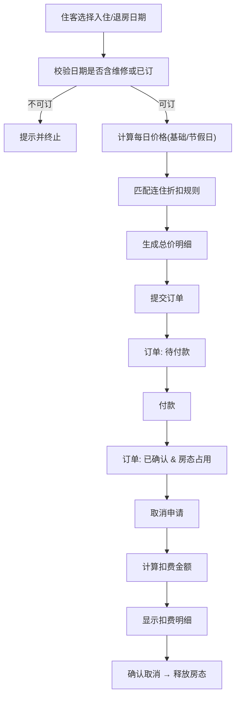

## 1. 产品概述
民宿房态价历系统，面向房东、住客和运营人员三类用户，提供房间管理、房态日历、价格配置、订单处理和维修管理等核心功能，解决民宿运营中房态、价格、维修、订单信息割裂的问题，实现各业务状态联动更新。

- **核心价值**：通过日历视图直观展示房间状态（可订/已订/维修），价格规则（平日/节假日/连住折扣）灵活配置，订单与房态、维修状态自动联动。
- **目标用户**：民宿房东（房源维护、收益管理）、住客（查询可订、在线预订）、运营人员（维修调度、订单管控）。

## 2. 核心功能

### 2.1 用户角色

| 角色 | 登录方式 | 核心权限 |
|------|----------|----------|
| 房东 | 角色切换进入 | 房间档案管理、基础价格设置、节假日特殊价、连住折扣规则、订单查看 |
| 运营人员 | 角色切换进入 | 维修日期标记、维修记录管理、全量订单查看与状态变更 |
| 住客 | 角色切换进入 | 房态日历浏览、价格详情查看、选日期下单、订单管理与取消、扣费明细 |

### 2.2 功能模块

1. **首页/角色入口页**：三角色切换入口、功能卡片导航、核心数据概览
2. **房东端**：房间管理、价格策略（基础价/节假日价/连住折扣）、房态日历
3. **运营端**：维修日历、维修记录、订单管控
4. **住客端**：房态价历、预订下单、我的订单、取消扣费

### 2.3 页面详情

| 页面名称 | 模块名称 | 功能描述 |
|----------|----------|----------|
| 角色切换首页 | 角色入口卡 | 三个角色卡片点击进入对应视图，显示当前角色信息 |
| 角色切换首页 | 系统概览 | 今日入住、在住、维修房间数、当月订单统计 |
| 房东-房间管理 | 房间列表 | 房间增删改，包含房型、床型、面积、设施、图片、基础价格 |
| 房东-价格策略 | 基础价格 | 设置每个房间的平日价和周末价 |
| 房东-价格策略 | 节假日价格 | 自定义日期段设置特殊价格，优先级高于基础价 |
| 房东-价格策略 | 连住折扣 | 按连住晚数设置阶梯折扣（如3晚95折、7晚9折） |
| 房东-房态日历 | 日历视图 | 月视图展示每间房的状态（可订/已订/维修）与当日价格 |
| 运营-维修管理 | 维修日历 | 日历上标记维修时段，选择房间、填写原因、起止日期 |
| 运营-维修管理 | 维修记录 | 查看历史维修，编辑/取消未开始的维修 |
| 运营-订单管控 | 订单列表 | 全量订单查看、状态筛选、订单详情 |
| 住客-房态价历 | 房间选择 | 选择目标房间查看其房态与价格日历 |
| 住客-房态价历 | 日历视图 | 标记可订/不可订/已选中日期，显示每日价格，计算连住折扣后总价 |
| 住客-预订下单 | 预订表单 | 填写入住人信息、确认日期与价格明细、提交订单 |
| 住客-我的订单 | 订单列表 | 按状态筛选、查看订单详情 |
| 住客-订单取消 | 取消弹窗 | 显示取消规则、扣费明细、确认取消 |

## 3. 核心流程

### 3.1 住客预订流程
住客选择房间 → 浏览房态价历 → 选择入住/退房日期 → 系统计算总价（含连住折扣）→ 填写入住信息并提交 → 订单创建（待付款）→ 付款 → 订单生效（已确认）→ 占用房态

### 3.2 运营标记维修流程
运营人员进入维修日历 → 选择房间与日期段 → 填写维修原因 → 标记维修 → 对应日期在房态中置为维修（不可订）→ 若该日期已有待付款/已确认订单，需提示冲突

### 3.3 订单取消与扣费流程
住客/运营取消已付款订单 → 根据取消规则计算扣费（如入住前≥7天全额退，3-7天扣30%，<3天扣全款）→ 显示扣费明细 → 确认取消 → 释放房态、退款记录保存

## 4. 用户界面设计

### 4.1 设计风格
- **主色调**：暖色调 `#E07A5F`（陶土橙）象征民宿温馨，辅助色 `#3D405B`（深靛蓝）体现专业，中性色 `#F4F1DE`（米白）背景。
- **按钮风格**：圆角 12px，微渐变背景，悬停有轻微上浮阴影。
- **字体**：标题用「思源宋体」或 `Playfair Display` 类衬线字体传递质感；正文用系统无衬线保证可读性。
- **布局风格**：卡片式布局，大量留白，日历采用大格子突出日期状态色块。
- **图标风格**：使用 Lucide 线性图标，统一 20px 尺寸。

### 4.2 页面设计概览

| 页面名称 | 模块名称 | UI 元素 |
|----------|----------|----------|
| 角色切换首页 | 角色入口卡 | 3张卡片横排，各自主色渐变背景，图标+角色名+简要说明，悬停放大 |
| 房态日历 | 日历网格 | 月历大格子，每个格子显示价格与状态圆点（绿可订/蓝已订/红维修），顶部月份切换与房间选择器 |
| 价格策略 | 配置面板 | 左侧标签切换「基础价/节假日/连住折扣」，右侧表单区，卡片化输入 |
| 订单详情 | 详情页 | 上部状态条带步骤指示，中部日期/房型/金额信息，底部操作按钮区 |
| 取消弹窗 | 扣费明细 | 分层展示原价、退款金额、扣费金额与扣费规则说明 |

### 4.3 响应式
桌面端优先（≥1024px 三栏/双栏布局），平板端（768-1023px）折叠为单栏+抽屉，移动端（<768px）日历缩小格子、卡片纵向堆叠、底部 Tab 导航。

### 4.4 交互与动效
- 日历日期悬停：上浮 + 阴影加深，0.2s 过渡。
- 状态切换：颜色渐变过渡，状态变化有轻量 toast 提示。
- 价格计算：连住折扣匹配时数字滚动动效。
- 弹窗：背景模糊遮罩 + 内容缩放进入。
