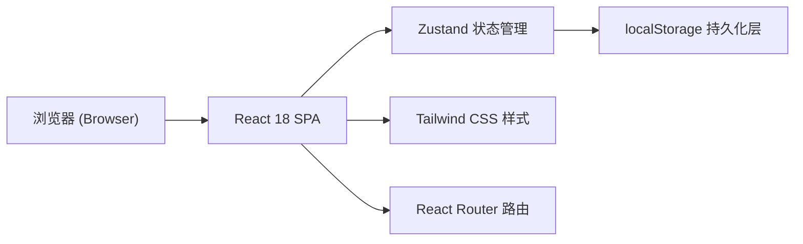
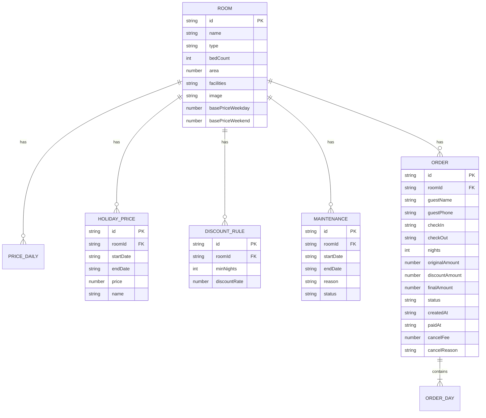

## 1. 架构设计



纯前端单页应用，无后端服务，所有数据通过 localStorage 在浏览器本地持久化。

## 2. 技术选型

| 层级 | 技术 | 说明 |
|------|------|------|
| 前端框架 | React@18 + TypeScript@5 | 组件化开发，类型安全 |
| 构建工具 | Vite@5 | 快速热更新，开箱即用 |
| 样式方案 | Tailwind CSS@3 | 原子化 CSS，快速迭代 UI |
| 状态管理 | Zustand@4 | 轻量级 store，支持 localStorage 中间件 |
| 路由 | React Router DOM@6 | 多角色视图路由切换 |
| UI 图标 | lucide-react | 线性图标库 |
| 数据持久化 | localStorage + zustand persist | 浏览器本地存储，初始化时加载示例数据 |

## 3. 路由定义

| 路由 | 页面 | 说明 |
|------|------|------|
| `/` | 角色选择首页 | 三角色入口卡片 + 概览数据 |
| `/host` | 房东端首页 | 房东功能导航 + 房态日历 |
| `/host/rooms` | 房间管理 | 房间 CRUD |
| `/host/pricing` | 价格策略 | 基础价、节假日价、连住折扣 |
| `/host/calendar` | 房态日历 | 房东视角日历 |
| `/host/orders` | 房东订单 | 房东查看订单 |
| `/ops` | 运营端首页 | 运营功能导航 |
| `/ops/maintenance` | 维修管理 | 维修日历 + 维修记录 |
| `/ops/orders` | 订单管控 | 全量订单查看与管理 |
| `/guest` | 住客端首页 | 房态价历 + 预订入口 |
| `/guest/booking` | 预订确认 | 确认订单信息并提交 |
| `/guest/orders` | 我的订单 | 住客订单列表与详情 |

## 4. 数据模型

### 4.1 实体关系图



### 4.2 数据状态枚举

```typescript
// 订单状态
type OrderStatus = 'pending' | 'paid' | 'confirmed' | 'checkedIn' | 'checkedOut' | 'cancelled';

// 维修状态
type MaintenanceStatus = 'scheduled' | 'inProgress' | 'completed' | 'cancelled';

// 日期房态
type DayStatus = 'available' | 'booked' | 'maintenance' | 'selected';
```

### 4.3 价格计算规则

```
1. 单日价格优先级：节假日价 > 周末价/平日价
2. 连住折扣匹配：取满足 nights >= minNights 的最大折扣率
3. 原价 = Σ(每日价格)
4. 折扣额 = 原价 × (1 - 折扣率)
5. 实付 = 原价 - 折扣额
```

### 4.4 取消扣费规则

| 距入住天数 | 扣费比例 |
|-----------|---------|
| ≥ 7 天 | 0%（全额退） |
| 3 - 6 天 | 30% |
| < 3 天 | 100% |

## 5. 项目目录结构

```
src/
├── components/           # 可复用组件
│   ├── calendar/         # 日历相关组件
│   ├── common/           # 通用 UI（按钮、卡片、弹窗、Toast）
│   └── layout/           # 布局组件（导航、侧栏）
├── hooks/                # 自定义 hooks
│   ├── usePricing.ts     # 价格计算
│   ├── useAvailability.ts# 房态计算
│   └── useLocalStore.ts  # localStorage 封装
├── pages/                # 页面级组件
│   ├── Home.tsx
│   ├── host/
│   ├── ops/
│   └── guest/
├── store/                # Zustand stores
│   ├── roomStore.ts
│   ├── orderStore.ts
│   ├── maintenanceStore.ts
│   └── pricingStore.ts
├── types/                # TypeScript 类型定义
│   └── index.ts
├── utils/                # 工具函数
│   ├── date.ts           # 日期处理
│   ├── price.ts          # 价格计算
│   ├── storage.ts        # localStorage 封装
│   └── seed.ts           # 初始化示例数据
├── App.tsx
├── main.tsx
└── index.css
```
